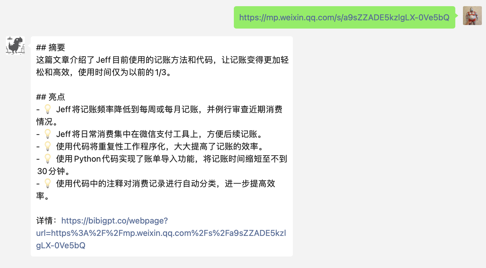
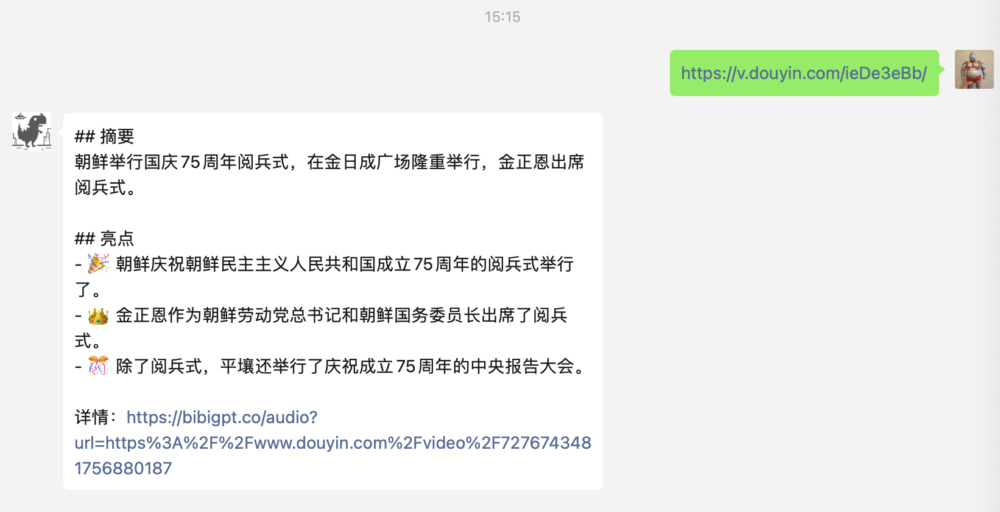
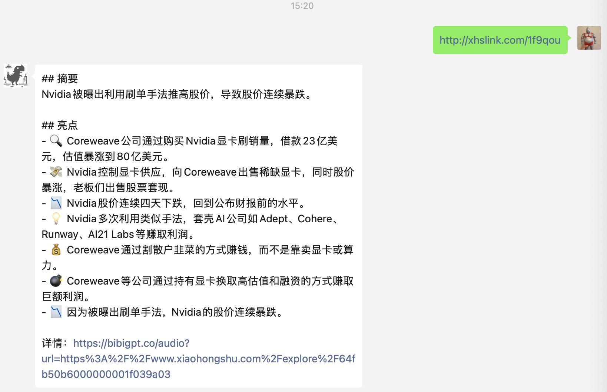

本插件为ChatGPT-ON-WeChat项目插件，实现的主要功能是对文章、视频、播客内容做总结，覆盖b站、抖音、快手、小红书、微信等各个平台！具体效果如下

# 安装
使用管理员口令在线安装即可
#installp https://github.com/fatwang2/sum4all.git
安装成功后，根据提示使用#scanp 命令来扫描新插件

# 申请
通过链接注册 https://bibigpt.co/r/90nEPW，获取key，注册免费有60min时长

# 配置
- 服务器部署：复制插件目录的config.json.template文件并重命名为config.json，在sum_key字段填入申请的key，
- docker部署：参考项目docker部署的插件使用，在挂载的config.json配置文件内增加sum4all插件的配置参数，如下图，每次重启项目，需要使用 #installp 指令重新安装