## 用户交流
[telegram频道](https://sum4all.site/telegram)\
[X](https://sum4all.site/twitter)

## 友情赞助
<a href="https://www.buymeacoffee.com/fatwang2" target="_blank"></a>

## 简介
本项目为大模型内容总结服务，有微信插件、[telegram机器人](https://t.me/sum4all_bot)
、[iOS快捷指令](https://sum4all.site/shortcuts)
三个版本，其中微信插件需要自行部署，需配合[chatgpt-on-wechat](https://github.com/zhayujie/chatgpt-on-wechat)项目，其他插件可点击链接自行体验

## iOS快捷指令
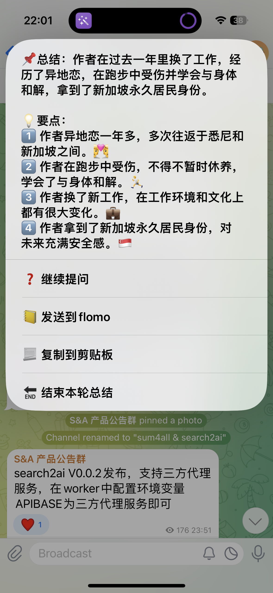

## telegram机器人
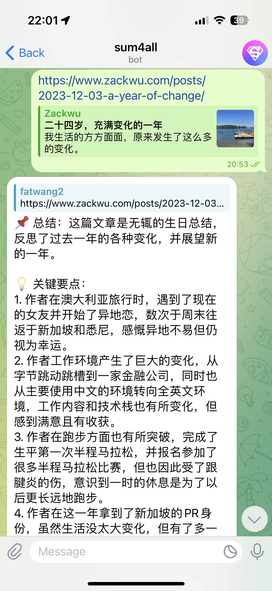

## 微信插件
### 更新日志
- V0.7.6，20240420，修复微信链接规则编号带来的解析失败问题
- V0.7.5，20240405，sum4all service支持图片识别，模型为 gpt-4-vision-preview，合并简化代码
- V0.7.4，20240316，支持search1api搜索聚合服务，google、bing、duckduckgo自由切换
- V0.7.3，20240217，修改Gemini代理，修改为更稳定的cf代理
- V0.7.2，20240206，增加图片压缩逻辑，修复图片过大时无法总结的bug
- V0.7.1，20240130，修复关闭笔记功能时私聊无法总结网页的bug
- V0.7.0，20240122，增加记笔记功能，支持把链接总结内容发送给笔记服务，已支持flomo

[更多日志](https://github.com/fatwang2/sum4all/releases)


### 功能特点
- 支持联网搜索
- 支持多轮追问
- 支持文章链接总结，且支持发送到在线笔记
- 支持文件内容总结，包括pdf、docx、markdown、txt、xls、csv、html、ppt
- 支持图片总结，包括png、jpeg、jpg
- 支持视频、播客内容总结，包括抖音、b站、小红书、YouTube等
- 支持多种内容总结服务，可自由组合
- 支持自定义prompt
- 支持自定义搜索、追问提示词
<table>
  <tr>
    <td>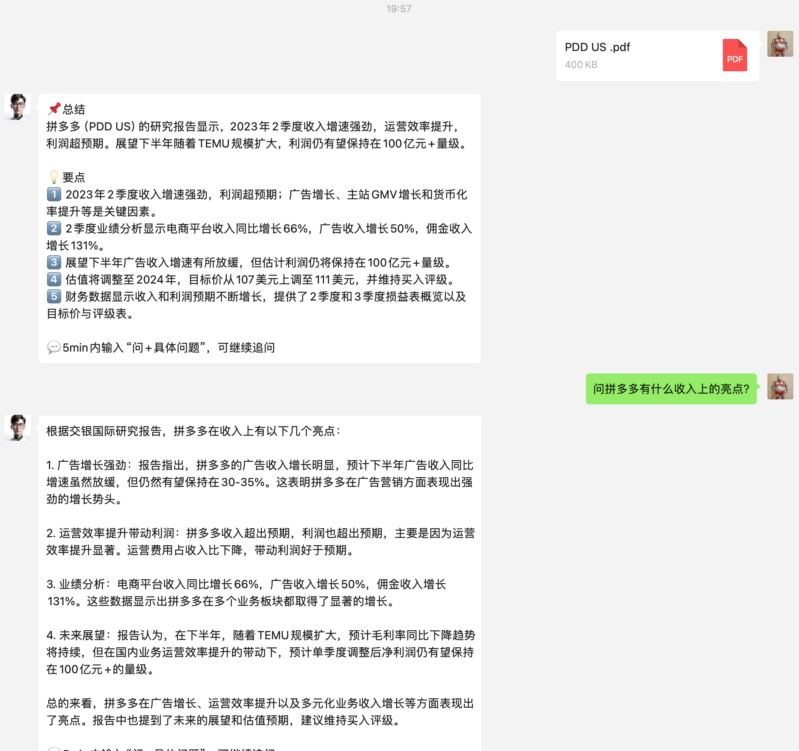</td>
    <td>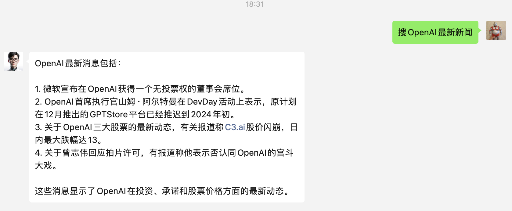</td>
  </tr>
  <tr>
    <td>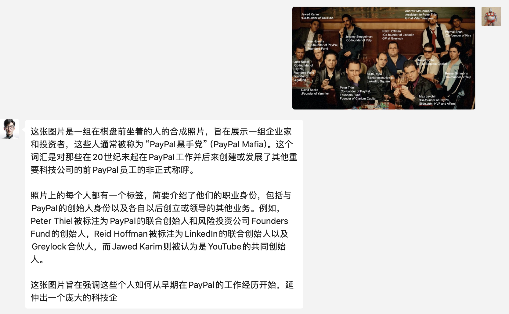</td>  
    <td>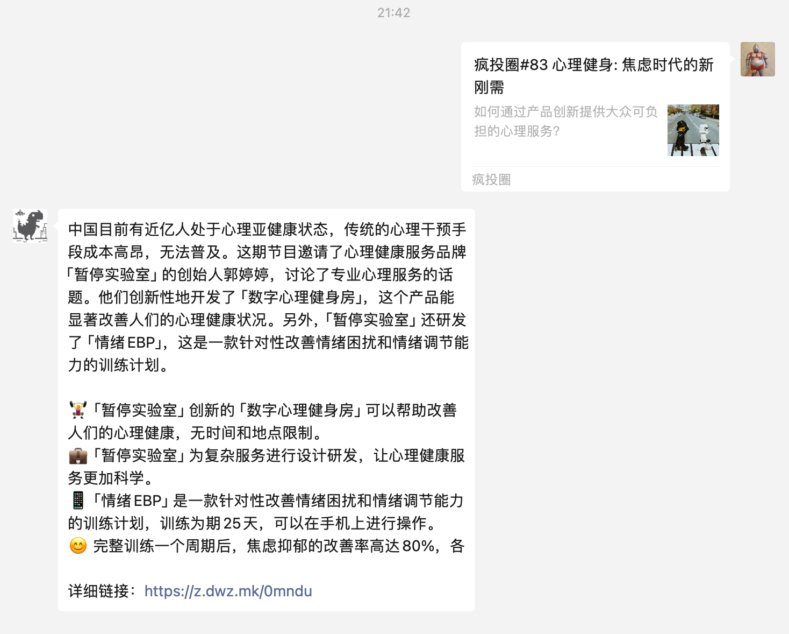</td>
  <tr>
    <td>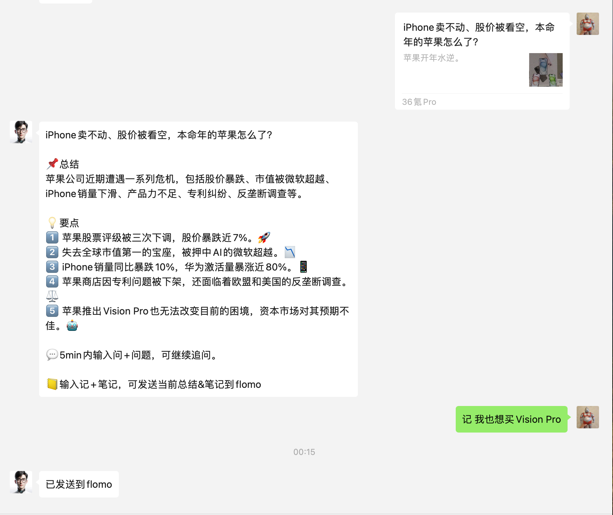</td>
    <td>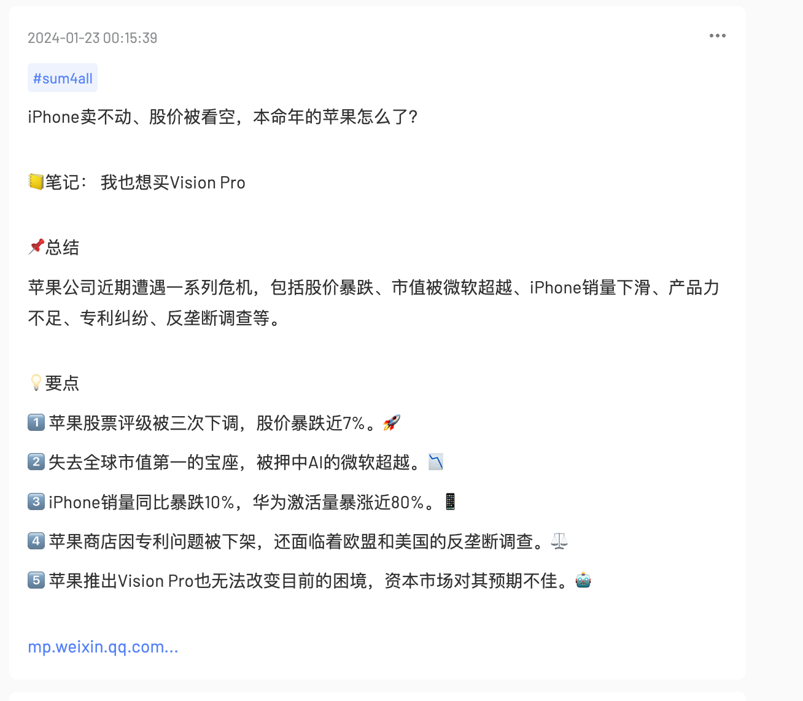</td>
  </tr>
  </tr>
  <tr>
    <td>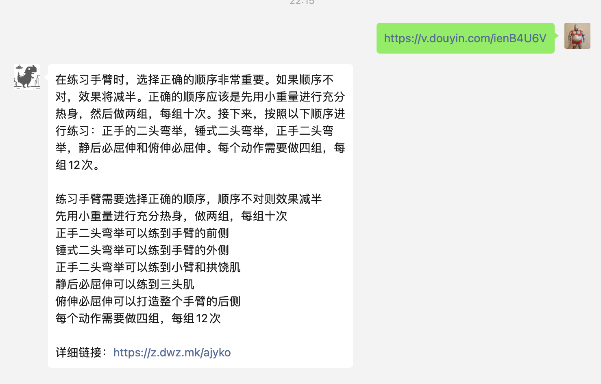</td>    
    <td></td> 
  </tr>
  
</table>

### 安装
使用管理员口令在线安装，管理员认证方法见：[管理员认证](https://github.com/zhayujie/chatgpt-on-wechat/tree/master/plugins/godcmd)
```
#installp https://github.com/fatwang2/sum4all.git
```
安装成功后，根据提示使用`#scanp` 命令来扫描新插件

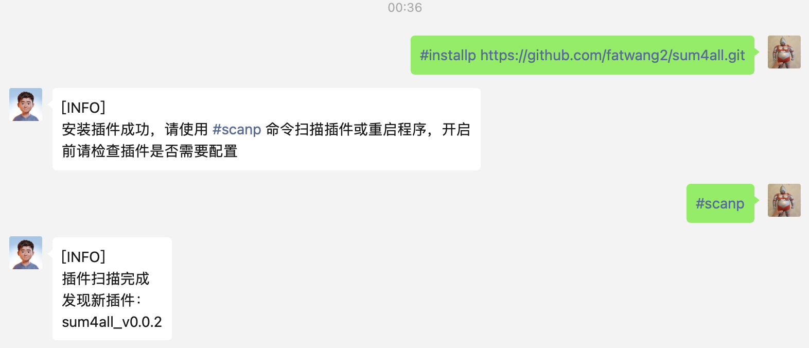

### 申请服务（自行选择，各有优劣）

| 服务 | 支持功能 | 特点 | 注册地址 | 图片介绍 |
|------|----------|------|----------|-----------|
| OpenAI | 搜索、文件、图片、绝大部分网页文章 | 无需额外申请服务，舍得花钱的话，效果最可控 | [OpenAI](https://platform.openai.com/account/api-keys) \| [LinkAI代理](https://sum4all.site/linkai) | 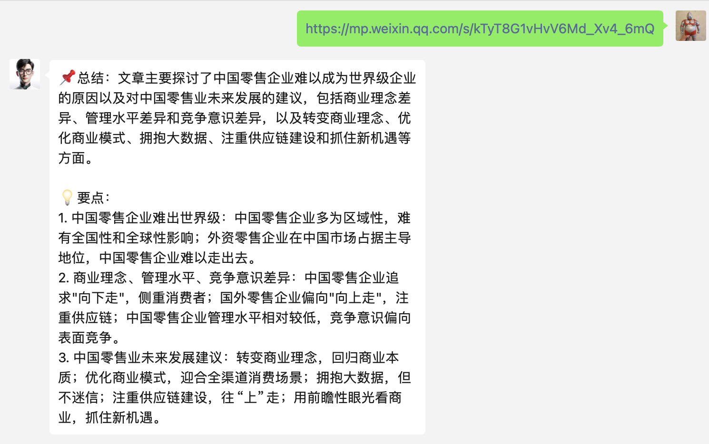 |
| sum4all | 搜索、文件、图片、绝大部分网页文章 | 注册免费送1万token，邀请好友注册再各得5k，是openai官方价的五折| [sum4all](https://sum4all.site/key) | 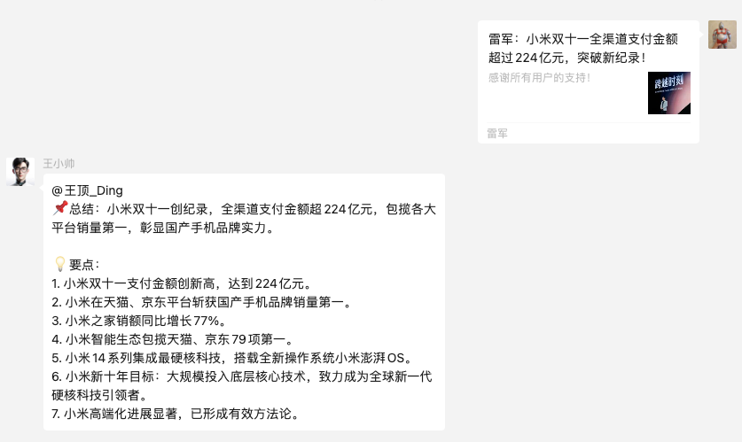 |
| search1api | Google、Bing、Duckduckgo搜索 | 搜索聚合服务，无需注册，$0.99/1000次每个月| [search1api](https://search2ai.online/api)| 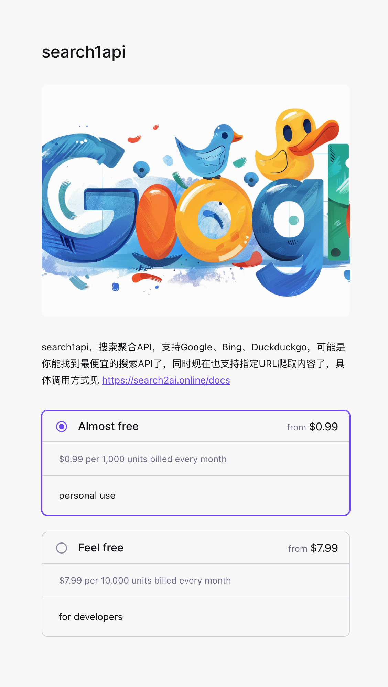 |
| Gemini | 搜索、文件、图片、绝大部分网页文章 | Google最新大模型，免费 | [gemini](https://sum4all.site/google) | 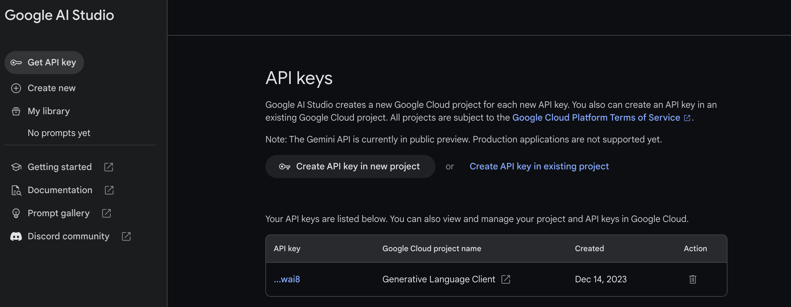 |
| Perplexity | 搜索 | 国外的搜索总结服务，速度快，价格贵，自带大模型，需自行注册和付费 | [Perplexity](https://sum4all.site/perplexity) |  | 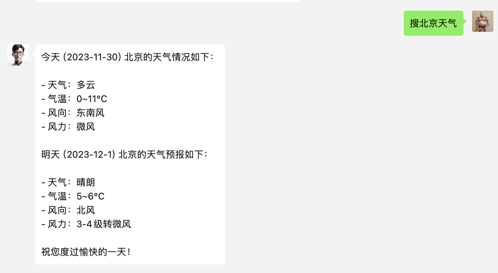 |
| 讯飞 | 图片 | 讯飞星火大模型的图片理解功能，免费200万token，随便用 | [xunfei](https://sum4all.site/xunfei) | 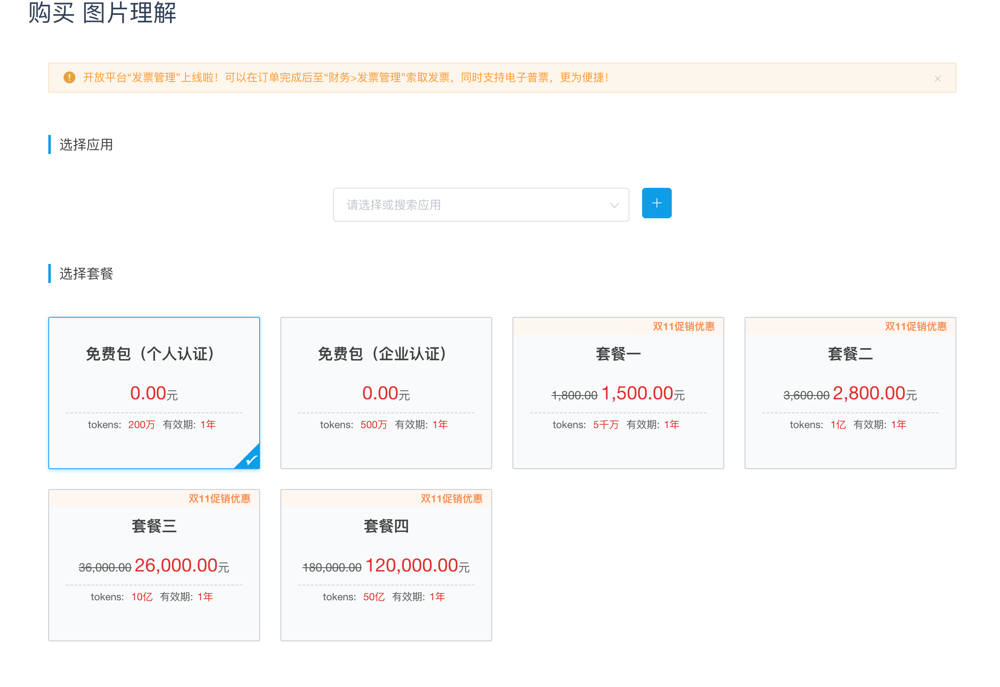 |
| flomo | 记笔记 | 邀请码:OTY0，可免费得14天pro会员 | [flomo](https://sum4all.site/flomo) | 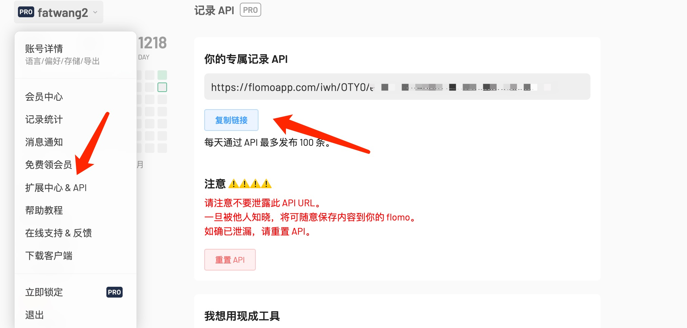 |
| BibiGPT | 文章、视频、音频 | 注册免费享有60min时长 | [BibiGPT](https://sum4all.site/bibigpt) |  |
| OpenSum | 微信、头条、即刻等平台网页文章 | 19元30万字 | [OpenSum](https://sum4all.site/opensum) |  |


### 配置
- 服务器部署：复制插件目录的`config.json.template`文件,重命名为`config.json`，配置参数即可
- docker部署：参考项目docker部署的插件使用，`config.json`内增加sum4all插件的配置参数，操作见 [docker插件配置](https://github.com/zhayujie/chatgpt-on-wechat#3-%E6%8F%92%E4%BB%B6%E4%BD%BF%E7%94%A8)

配置文件含义如下：
```
{
  "url_sum": {
    "enabled": true, #url总结服务开关
    "service": "sum4all", #url总结服务，目前支持openai、sum4all、gemini、bibigpt、opensum
    "group": true, #url总结群聊开关
    "qa_enabled":true, #url总结追问开关
    "qa_prefix":"问", #url总结追问前缀词
    "prompt": "" #url总结prompt
  },
  "search_sum": {
    "enabled": false, #搜索总结服务开关
    "service": "sum4all", #搜索总结服务，目前支持openai、sum4all、gemini、perplexity
    "search_service": "duckduckgo", #搜索服务，duckduckgo免费，google、bing 需配置 search1api 的key
    "group": true, #搜索总结群聊开关
    "search_prefix":"搜", #搜索总结前缀词
    "prompt": "" #搜索总结prompt
  },
  "file_sum": {
    "enabled": false, #文件总结服务开关
    "service": "sum4all", #文件总结服务，目前支持openai、sum4all、gemini
    "max_file_size": "15000", #支持的文件大小，单位kb，最终能否总结取决于有大模型的token限制
    "group": true, #文件总结群聊开关
    "qa_prefix":"问", #文件总结追问前缀词
    "prompt": "" #文件总结prompt
  },
  "image_sum": {
    "enabled": false, #图片总结服务开关
    "service": "gemini", #图片总结服务，目前支持openai、sum4all、gemini、xunfei
    "group": true, #图片总结群聊开关
    "qa_prefix":"问", #图片总结追问前缀词
    "prompt": "" #图片总结prompt
  },
  "note": {
    "enabled": false, #笔记服务开关
    "service": "flomo", #笔记服务，目前支持flomo，后面考虑支持notion
    "prefix":"记" #笔记服务前缀词
  },
  "keys": {
    "sum4all_key": "", #如选sum4all，则必填
    "search1api_key": "", #如search_service选google或bing，则必填，购买方式见上
    "gemini_key": "", #如选gemini，则必填
    "perplexity_key": "", #如选perplexity，则必填
    "open_ai_api_key": "", #如选openai，则必填
    "model": "gpt-3.5-turbo", #openai模型
    "open_ai_api_base": "https://api.openai.com/v1", #openai请求地址
    "xunfei_app_id": "", #讯飞大模型appid，如选xunfei，则必填
    "xunfei_api_key": "", #讯飞大模型apikey，如选xunfei，则必填
    "xunfei_api_secret": "", #讯飞大模型apisecret，如选xunfei，则必填
    "opensum_key": "", #如选opensum，则必填
    "bibigpt_key": "", #如选bibigpt，则必填
    "outputLanguage": "zh-CN" #bibigpt的输出语言，默认中文，其他支持列表见下
  }
}
```
bibigpt输出语言支持列表：
```
  English: 'en-US',
  中文: 'zh-CN',
  繁體中文: 'zh-TW',
  日本語: 'ja-JP',
  Italiano: 'it-IT',
  Deutsch: 'de-DE',
  Español: 'es-ES',
  Français: 'fr-FR',
  Nederlands: 'nl-NL',
  한국어: 'ko-KR',
  ភាសាខ្មែរ: 'km-KH',
  हिंदी: 'hi-IN',
```

### 后续计划
- 支持新闻搜索
- 支持记录到notion
- 支持当日总结
- 支持输出总结图片
- 支持视频号总结
- 支持通过管理员指令切换内容总结服务、配置参数等