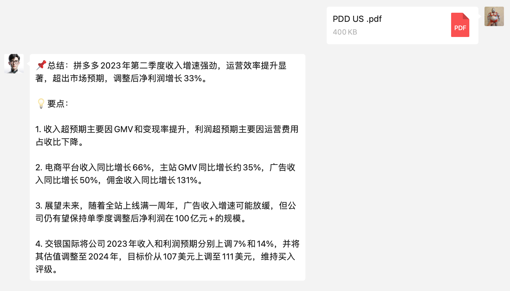

## 用户交流
[telegram频道 ](https://t.me/+w2Z8S0Y8H2IxZDI9)

## 更新日志
- V0.5.1，20231209，群聊开关支持图片、文件，可通过修改配置文件的group_sharing来判断是否支持自动对群聊的图片、文件做总结
- V0.5.0，20231206，新增支持讯飞图片总结功能，免费赠送200万token，感谢alexgang的PR
- V0.4.1，20231203，调整图片总结功能的最大token为3000，避免截断
- V0.4.0，20231203，支持图片总结功能，png、jpeg、jpg等，需更新配置文件
- V0.3.4，20231202，修复插件配置更新问题，已支持插件更新后通过reloadp重新加载生效
- V0.3.0，20231202，支持文件总结功能，常见pdf、doc、markdown、txt、xls、csv、html、ppt格式均支持，需安装requirements.txt依赖，更新配置文件
- V0.2.6，20231130，新增支持Perplexity搜索，需自行注册申请key，更新配置文件
- V0.2.5，20231130，新增搜索prompt，支持单独配置
- V0.2.4，20231125，新增各参数默认值，避免升级未修改配置文件带来的问题，修复OpenSum格式异常问题
- V0.2.3，20231125，更新短链接服务
- V0.2.2，20231124，简化sum4all搜索代码，新增文章总结的标题，新增搜索总结的参考文章与链接
- V0.2.1，20231118，简化sum4all服务的代码，更新默认prompt
- V0.2.0，20231112，新增搜索功能，搜索并总结内容，默认不开启，目前仅支持 Sum4all 的token
- V0.1.6，20231112，新增 Sum4all 官方总结服务，其实就是自己套了个国产大模型，注册免费送10万token，邀请好友注册再各得5万
- V0.1.5，20231112，整合三种服务的代码，全部支持分享链接卡片
- V0.1.3，20231112，新增支持OpenAI、OpenSum两种总结服务，通过配置文件可切换；支持Docker部署
- V0.1.0，20231025，去除重复短链接
- V0.0.9，20231002，新增group_sharing参数，设为false时，群聊不自动总结卡片链接。新增对不支持链接的回复提示，感谢befantasy的PR
- V0.0.8，20230927，屏蔽小程序与视频号链接，暂时不支持
- V0.0.7，20230926，去除短链接服务key的配置，自建短链接服务开放使用，无需单独申请
- V0.0.6，20230925，支持用户配置自己的短链接服务key，新增短链接生成失败时的兜底机制
- V0.0.5，20230925，支持配置语言参数，变量在config.json中，默认中文
- V0.0.4，20230925，详情长链接转换成短链接，去除原有markdown格式标记，内容更简洁
- V0.0.3，20230924，支持微信文章链接卡片识别，chatgpt-on-wechat需更新到最新代码
- V0.0.2，20230924，插件更名，支持插件目录内的配置文件
- V0.0.1，20230910，发布视频、文章总结插件

## 简介
本项目为微信插件，需配合[chatgpt-on-wechat](https://github.com/zhayujie/chatgpt-on-wechat)项目使用

## 功能特点
- 支持联网实时搜索
- 支持文章内容总结，个人微信支持链接卡片和url，企微支持url
- 支持文件内容总结，包括pdf、doc、markdown、txt、xls、csv、html、ppt
- 支持图片总结，包括png、jpeg、jpg
- 支持视频、播客内容总结，包括抖音、b站、小红书、YouTube等
- 支持多种内容总结服务，可自由组合
- 支持自定义prompt
<table>
  <tr>
    <td></td>
    <td></td>
    <td></td>
  </tr>
  <tr>
    <td></td>
    <td></td>    
    <td></td> 
  </tr>
</table>

## 安装
使用管理员口令在线安装，管理员认证方法见：[管理员认证](https://github.com/zhayujie/chatgpt-on-wechat/tree/master/plugins/godcmd)
```
#installp https://github.com/fatwang2/sum4all.git
```
安装成功后，根据提示使用`#scanp` 命令来扫描新插件


## 申请服务（自行选择，各有优劣）

| 服务 | 支持功能 | 特点 | 注册地址 | 图片介绍 |
|------|----------|------|----------|-----------|
| OpenAI | 文件、图片、绝大部分网页文章 | 无需额外申请服务，舍得花钱的话，效果最可控 | [OpenAI](https://platform.openai.com/account/api-keys) \| [LinkAI代理](https://sum4all.site/linkai) |  |
| Sum4all | 搜索、文件、绝大部分网页文章 | 注册免费送1万token，邀请好友注册再各得5k，觉得好用的还可以注册Poe上的同名机器人 | [sum4all](https://sum4all.site/key) \| [Poe Sum4all机器人](https://sum4all.site/poe) |  |
| Perplexity | 搜索 | 国外的搜索总结服务，速度快，价格贵，自带大模型，需自行注册和付费 | [Perplexity](https://sum4all.site/perplexity) |  |  |
| 讯飞 | 图片 | 讯飞星火大模型的图片理解功能，免费200万token，随便用 | [xunfei](https://sum4all.site/xunfei) |  |
| BibiGPT | 文章、视频、音频 | 注册免费享有60min时长 | [BibiGPT](https://sum4all.site/bibigpt) |  |
| OpenSum | 微信、头条、即刻等平台网页文章 | 19元30万字 | [OpenSum](https://sum4all.site/opensum) |  |


## 配置
- 服务器部署：复制插件目录的`config.json.template`文件,重命名为`config.json`，配置参数即可
- docker部署：参考项目docker部署的插件使用，`config.json`内增加sum4all插件的配置参数，操作见 [docker插件配置](https://github.com/zhayujie/chatgpt-on-wechat#3-%E6%8F%92%E4%BB%B6%E4%BD%BF%E7%94%A8)

各参数含义如下：
```
"sum_service":"", #内容总结服务，openai、sum4all、bibigpt、opensum
"search_sum":"", #搜索开关，默认不开启，开启需改为 true，在微信端使用时，需要以“搜”字开头才会触发
"file_sum": false, #文件总结开关，默认不开启，开启需改为 true，目前支持sum_service为openai和sum4all
"image_sum": false, #图片总结开关，默认不开启，开启需改为 true，目前支持sum_service为为openai
"search_service":"", #搜索服务，目前支持sum_service为sum4all和perplexity
"image_service":"", #图片总结服务，目前支持openai和xunfei
"group_sharing": true, #是否支持群聊内的链接卡片、文件和图片
"sum4all_key":"", #如选sum4all，则必填
"xunfei_app_id": "", #讯飞大模型appid，如图片总结服务选择xunfei，则必填
"xunfei_api_key": "", #讯飞大模型apikey，如图片总结服务选择xunfei，则必填
"xunfei_api_secret": "" #讯飞大模型apisecret，如图片总结服务选择xunfei，则必填
"opensum_key": "", #如选opensum，则必填
"open_ai_api_key": "", #如选openai，则必填
"perplexity_key":"", #如搜索服务选perplexity，则必填
"model": "gpt-3.5-turbo-1106", #openai模型
"open_ai_api_base": "https://api.openai.com/v1", #openai请求地址
"prompt": "你是一个新闻专家，我会给你发一些网页内容，请你用简单明了的语言做总结。第一部分是「📌总结」，一句话讲清楚整篇文章的核心观点，控制在50字左右，第二部分是「💡要点」，用数字序号列出来3-5个文章的核心内容。如果需要可以使用emoji让你的表达更生动" #openai内容总结prompt
"search_prompt":"你是一个信息检索专家，请你用简单明了的语言，对你收到的内容做总结。尽量使用emoji让你的表达更生动" #搜索总结prompt
"bibigpt_key": "", #如选bibigpt，则必填
"outputLanguage": "zh-CN",#bibigpt的输出语言，默认中文，其他支持列表见下
```
bibigpt输出语言支持列表：
```
  English: 'en-US',
  中文: 'zh-CN',
  繁體中文: 'zh-TW',
  日本語: 'ja-JP',
  Italiano: 'it-IT',
  Deutsch: 'de-DE',
  Español: 'es-ES',
  Français: 'fr-FR',
  Nederlands: 'nl-NL',
  한국어: 'ko-KR',
  ភាសាខ្មែរ: 'km-KH',
  हिंदी: 'hi-IN',
```


## 后续计划
- 结构化配置文件
- 支持企业微信的链接卡片
- 支持输出总结图片
- 支持文章、文件对话
- 支持视频号总结
- 支持通过管理员指令切换内容总结服务、配置参数等

## 赞助地址
